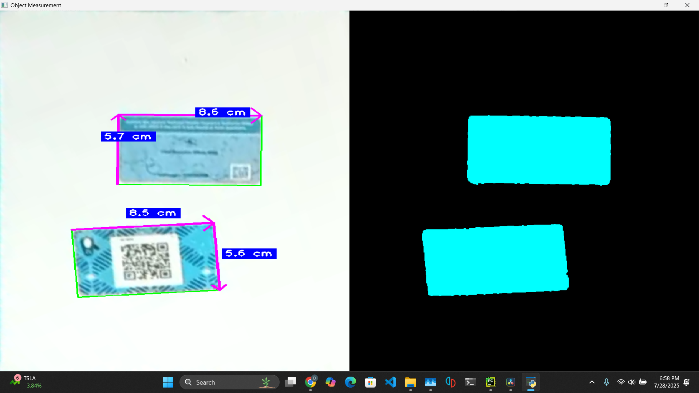

# Object Measurement with A4 Calibration

This project implements a computer vision system that uses a printed A4 paper as a reference object to measure real-world dimensions of other objects in the scene. The application can run on a live webcam feed or on a static image.

## Features

- **A4 paper detection**: Automatically detects the largest quadrilateral in the frame (assumed to be A4 paper).
- **Perspective warp**: Transforms the view so that the A4 paper appears fronto-parallel and scaled correctly in pixels.
- **Object measurement**: Finds arbitrary contours, fits oriented bounding boxes (`cv2.minAreaRect`), and computes real-world width and height in centimeters.
- **Arrow annotations**: Draws arrowed lines indicating width and height measurements on each detected object.
- **Interactive modes**:
  - **Detection Mode**: Detects A4 paper and prompts user to confirm.
  - **Measurement Mode**: Measures objects once the paper is confirmed.
- **Reset & quit controls**: Easily switch between modes or exit.

## Getting Started
```bash
git clone https://github.com/donsolo-khalifa/ObjectMeasure.git
cd ObjectMeasure
```

## Dependencies
```bash
pip install -r requirements.txt
```
- Python 3.7+
- OpenCV (`opencv-python`)
- NumPy
- cvzone

You can install dependencies via pip:

```bash
pip install opencv-python numpy cvzone
```

## File Structure

```
project_folder/
├── main.py           # Main application script
├── requirements.txt  # Python dependencies
└── README.md         # This file
```

## Configuration

In `main.py`, you can adjust:

- **Camera source**: `USE_WEBCAM` (True/False) and `IMAGE_PATH` for static images.
- **Camera index and resolution**:
  ```python
  cap = cv2.VideoCapture(1)  # change to 0 or other index
  cap.set(3, 1280)
  cap.set(4, 720)
  ```
- **A4 dimensions** (in millimeters):
  ```python
  A4_WIDTH_MM = 210
  A4_HEIGHT_MM = 297
  ```
- **Scale** (pixels per millimeter):
  ```python
  PIXEL_PER_MM_SCALE = 3
  ```
- **Minimum contour area** for object detection:
  ```python
  MIN_AREA = 1300  # in px²
  ```

## Usage

1. **Run the script**:
   ```bash
   python main.py
   ```
2. **Detection Mode** (default):
   - Hold or place an A4 paper in view of the camera.
   - The script will outline it in green when detected.
   - Press `c` to confirm and switch to Measurement Mode.
3. **Measurement Mode**:
   - Place objects on or against the A4 reference.
   - The system will draw arrowed lines showing width and height in cm.
   - Press `r` to reset back to Detection Mode.
   - Press `q` to quit the application.

## How It Works

1. **Detection**: Converts each frame to grayscale, blurs, and applies Canny edge detection. Uses `cvzone.findContours` filtering for 4-corner shapes to find the paper.
2. **Warp**: Computes a perspective transform mapping the detected paper corners to a fixed-size rectangle (matching real A4 dimensions scaled to pixels).
3. **Measurement**: On the warped image:
   - Detects edges and contours.
   - Filters contours by area.
   - Fits a rotated bounding box (`cv2.minAreaRect`).
   - Calculates real-world sizes by dividing pixel lengths by the known pixels-per-millimeter scale.
   - Draws arrowed annotations and labels.

## Notes

- Ensure good lighting and high contrast between paper and background for reliable detection.
- If the paper is not detected, adjust camera position or increase `minArea`.
- The scale factor (`PIXEL_PER_MM_SCALE`) trades off image resolution vs. processing speed.

*Happy measuring!*

